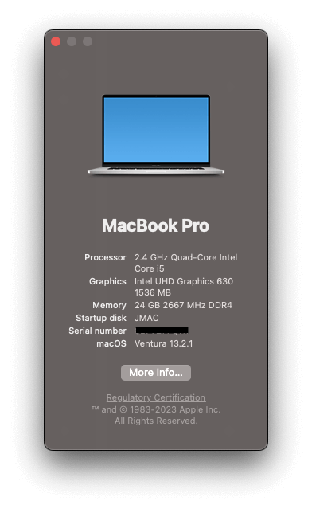
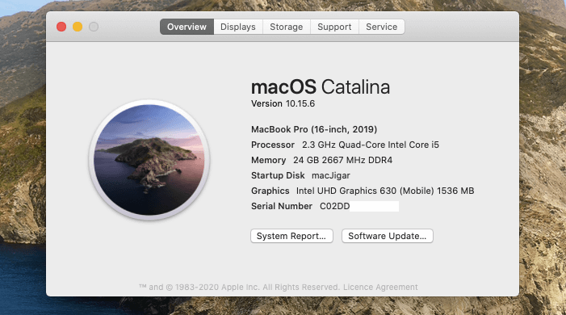

# Acer Nitro 5 AN515-54 Hackintosh

# JpMac - Hackintosh ♥

## Auto Boot - Auto select default mac drive
edit EFI/OC/config.plist
Now in our config.plist, we have 4 things we need to fix:
Misc -> Boot -> ShowPicker  = false 
<key>ShowPicker</key>
<true/> 

Others Open core Setting:: 

    Misc -> Boot -> PickerMode: External
    Misc -> Boot -> PickerAttributes: 17
        This enables mouse/trackpad support as well as .VolumeIcon.icns reading from the drive, allows for macOS installer icons to appear in the picker
    UEFI -> Drivers and add OpenCanopy.efi

!!! - Set SATA mode to AHCI (Use CTRL+S in BIOS to show hidden setting for SATA Mode menu)
Once all this is saved, you can reboot and be greeted with a true Mac-like GUI:

# Open Core 1.0.3
OpenCore Config

#### LauncherOption
<key>LauncherOption</key>
<string>Full</string>
#### Boot Arg. for debug log: -v for disable GPU: -wegnoegpu
<key>boot-args</key>
<string>-igfxblt -igfxbls</string>
#### Set your own
<key>SystemSerialNumber</key>
<string></string>
<key>SystemUUID</key>
<string></string>
#### OpenCore Theme
<key>PickerVariant</key>
<string>Acidanthera\GoldenGate</string>

## macOS Sequoia 15.3

## Support macOS Sonoma 14.7.3

## Support macOS Ventura (version 13.2.1)

*System Settings*

## Supports macOS Monterey (version 12.0)

## Supports Big Sur MacOS 11.0.1

## Supports macOS Catalina 10.15.6

## My System
- Intel® Core™ i5-9300H
- Intel® UHD Graphics 630 & Nvidia GeForce® GTX 1050
- LG 1920x1080 15,6" 144Hz IPS Panel
- Intel® Wi-Fi 6 AX200
- 24gb 2666mHz of DDR4 RAM
- XPG 256gb M.2 (PCIe® NVMe™)
- Realtek HD Audio ALC255
- ELAN 0504 Touchpad
- BIOS Version 1.30

## Important Note
- THIS IS ILLEGAL USE IN PERSONAL ONLY!!!
- Set SATA mode to AHCI (Use CTRL+S in BIOS to unhide SATA Mode menu)
- Disable Secure Boot
- Generate new SMBIOS (https://github.com/corpnewt/GenSMBIOS) - Optional
- Fix the CFG-Lock for Better Power Management (https://dortania.github.io/OpenCore-Desktop-Guide//extras/msr-lock)

## Instalation Guide
- You need install through this EFI :v

## What's Working:
- [x] Audio, Input/Mic, Output & ComboJack (https://github.com/hackintosh-stuff/ComboJack)
- [x] iGPU with disabled dGPU
- [x] Battery Management
- [x] ACPI Display brightness with hot keys / slider
- [x] Ethernet
- [x] Sleep & Wake
- [x] WebCam
- [x] Usb 3.1 & Type C (Mapped USB)
- [x] WiFi & Bluetooth
- [x] Native hotkey support with Fn keys
- [x] Touchpad and gestures
- [x] System Update
- [x] Intel® Wi-Fi 6 AX200 (https://github.com/zxystd/itlwm)

## Not Working:
- HDMI due to Nvidia Optimus
- Nvidia GeForce® GTX 1050 (No Hope....)

## Credits
- **Special Thanks** to [dortania](https://dortania.github.io/OpenCore-Install-Guide/) for the vanilla laptop guide.
- **Special Thanks** to [Acidanthera](https://github.com/acidanthera) for most of the Kexts.
- Thanks to [OpenCore Bootloader](https://https://github.com/acidanthera/OpenCorePkg).
- Thanks to [daliansky](https://github.com/daliansky) for [ACPI Hotpatch Samples for the OpenCore Bootloader](https://github.com/daliansky/OC-little).
- Thanks to [alexandred](https://github.com/alexandred) for [VoodooI2C](https://github.com/alexandred/VoodooI2C).
- Thanks to [hackintosh-stuff](https://github.com/hackintosh-stuff) for [ComboJack support for ALC255](https://github.com/hackintosh-stuff/ComboJack).
- Thanks to [corpnewt](https://github.com/corpnewt) for [GenSMBIOS](https://github.com/corpnewt/GenSMBIOS).
